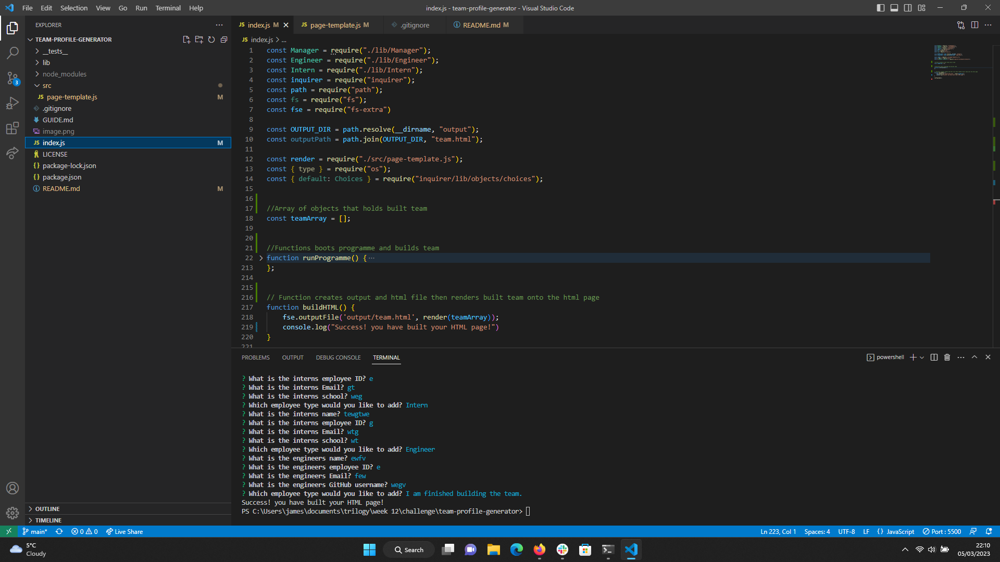

## Team Profile Generator

## Description

The team profile generator is a backend node.js command line application that takes in user information to build a software engineering team, then generates CSS styled HTML document displaying information on team members. The application is backend based, utilising node.js and the inquirer package to gather and push information from the user. An object-orientated approach was taken to build the template for team profiles, utilising objects, classes, subclasses, constructors and methods. A test driven approach was also taken, with all object templates tested using jest. 

This project developed my knowledge of backend workflows and allowed my to gain a greater understanding of the possibilites of node.js and it's various packages. I also gained an insight as well as hands on experience of object oriented programming and it's benefits. ES6 logic and syntax was also applied allowing me to further improve my experience and knoweldge of these approaches. The fact that the programme is backed up by testing also allowed me to take a professional approach to programming alleviating errors where possible and ensuring the programme functions and stays working.

## Installation

Node.js must be installed as well as the inquirer and jest packages.

## Usage

Users should ensure node.js is installed to use the program. Users should run 'npm install' within the command line to download the relevant packages. User should then run the 'index.js' module within node to be given prompts. Once prompts are answered the an output directory will be created with an output html files. This file will populate with the information the user fed into node. 

## Credits

N/A.

## License

please see license file in main branch of gitHub repository.

## Features

* A command-line application that accepts accepts user input using the inquirer package.
* Backend application utilising node.js.
* Validated prompts ensuring the user enters information correctly.
* Object oriented programming approach to create template classes and subclasses for user input.
* Testing using 'Jest'.
* ES6 syntax.

